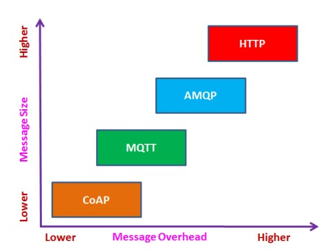

# Thesis :

# Choice of Effective Messaging Protocols for IoT

# Systems : MQTT, CoAP, AMQP and HTTP

<br /><br />

```Javascript
궁금한 부분 :
HTTP 가 Single Protocol 인 이유
IoT가 Single Protocol에 의존할 수 없는 이유
```

```Javascript
1차구분

- To address applications requiring fast and reliable business transactions
    - AMQP

- To address applications requiring data collection(e.g. sensor update) in constrained network
    - MQTT
    - CoAP

- To address applications requiring communicating over the Internet such as RESTful client/server
    - HTTP
    - CoAP
```

---

# About Protocol

### MQTT

```python
- 가장 오래된 M2M(Machine to Machine) 통신 프로토콜이다.
- 제한된 네트워크에서 가벼운 M2M 통신을 위해 설계된 pub/sub 메시징 프로토콜이다.
- MQTT 클라이언트는 (다른 클라이언트가 subscribe하거나 향후 subscribe를 위해 보유할 수 있는) MQTT 브로커에 메시지를 게시한다.
- 모든 메시지는 각 topic에 맞게 게시된다. -전송 프로토콜로 TCP를 사용하고 보안을 위해 TLS/SSL을 사용합니다. => client와 broker 간의 connection-oriented 이다.
- Using 3-level QoS(Quality of Service) => for reliable delivery of messages.
- Suitable for large networks of small devices that need to be monitored or controlled from a back-end server on the Internet.
```

### CoAP

```python
- It is mainly developed to interoperate with HTTP and the RESTful Web through simple proxies.
- MQTT와 다르게 CoAP 는 topic이 아닌 URI를 사용한다.
- Publisher는 URI로 data를 publish하고, subscriber는 URI로 표현된 특정 리소스에 subscribe를 한다.
- CoAP는 전송 프로토콜로 UDP를 사용하고, 보안을 위해 DTLS를 사용한다. 따라서 clients와 server는 적은 신뢰도의 connectionless datagram방식을 통해 통신한다.
- QoS를 지원하기 위해 "confirmable(전송에 대한 ACK받음)" 레벨과 "non-confimable(아무것도 안받음)" 레벨을 사용한다.
```

### AMQP

```python
- 가벼운 M2M 프로토콜이다.
- Reliability, security, provisioning and interoperability
- Request/Response 및 Publish/Subscribe 구조를 모두 지원한다.
- AMQP에서는 Publisher 혹은 Consumer 가 지정된 이름으로 "exchange"를 만든 후 해당 이름을 브로드캐스팅 해야한다.
- 서로를 구분하기 위해 "exchange"에 지정된 이름을 사용한다.
- "exchange"에서 수신한 메시지는 "binding"이라는 과정을 통해 queue와 일치되어야 한다.
- AMQP 는 전송프로토콜로 TCP를 사용하며, 보안을 위해 TLS/SSL 그리고 SASL을 사용한다. => client와 broker 간의 connection-oriented이다.
- 두가지 레벨의 QoS를 지원 : Unsettle Format(not reliable) & Settle Format(reliable)
- 신뢰성이 AMQP의 가장 큰 특징
```

### HTTP

```python
- 주로 web messaging protocol로 사용된다.
- HTTP는 request/response RESTful Web architecture를 지원한다.
- CoAP와 유사하게 URI 방식을 사용하며, 서버에서 URI를 통해 데이터를 제공하면 client는 URI를 통해 데이터를 공급 받는다.
- Text-based protocol 이다.
- HTTP는 전송 프로토콜로 TCP를 사용하며, 보안을 위해 TLS/SSL을 사용한다. => client와 server 간의 connection-oriented이다.
- 별도의 명시적인 QoS를 가지고있지 않으며, 이를 위한 support를 필요로한다.
```

---

# The Comparison between each Protocol : MQTT, CoAP, AMQP and HTTP

### 1. Message Size vs Message Overhead

- MQTT, AMQP and HTTP run on TCP => 연결 및 연결종료에 오버헤드가 존재
- MQTT는 가볍고 메시지당 2바이트의 가장 작은 헤더크기를 가지지만 TCP 연결 요구 사항은 전체 오버헤드를 증가시켜 메시지 크기를 증가시킴.
- AMQP는 reliability, security, provisioning and interoperability를 보장하기에 오버헤드가 크다.
- HTTP는 IoT가 아닌 Web을 위해 설계되었기에 최대의 오버헤드 및 메시지 크기를 가진다.
- CoAP runs on UDP => 연결에 별다른 오버헤드가 따르지 않는다.



### 2. Power Consumption vs Resource Requirement

- MQTT 와 CoAP는 낮은 대역폭과 리소스가 제한된 장치용으로 설계되었고, 같은 상황에서는 CoAP가 전력과 리소스를 덜 소모함.
- AMQP는 필요한 기능(provisioning and reliability)들을 수행하기 위해 조금 더 많은 전력과 리소스를 소모함.
- HTTP는 가장 많은 전력과 리소스를 사용한다.

### 3. Bandwidth vs Latency

- MQTT, AMQP 그리고 HTTP 는 TCP 가 Bandwidth와 Latency를 결정하는 주요한 요인이다.
- TCP의 slow start 방식 때문에 연결의 처음 몇번의 왕복에 사용 가능한 네트워크 대역폭을 완전히 활용하지 못한다. 여기서 TCP는 정체 창을 점차적으로 열고 각 왕복 시간에 패킷 수를 두배로 늘린다. => 대역폭은 넓지만 활용하지 못하고, 지연시간이 생김
- CoAP에서 UDP 트랜잭션에서는 각 방향으로 하나씩 두개의 UDP 데이터그램만 필요합니다. 이렇게 하면 네트워크 load 응답 시간이 줄어듭니다.

### 4. Reliability/QoS vs Interoperability

- TCP 기반 프로토콜의 가장 큰 장점은 패킷전달이 보장된다는 점이다.(the guaranteed delivery of a packet)
- MQTT의 경우 QoS 0, 1, 2를 지원하고, disconnect를 보장하기 위해 "last will and testament"를 사용한다.
- AMQP와 CoAP의 경우 두개 레벨의 QoS를 지원한다. => CoAP의 경우 TCP를 사용하지 않기에 재전송 메커니즘을 정의하고 자원 탐색 메커니즘을 제공하여 신뢰성을 보장.
- HTTP의 경우 QoS를 따로 정의하지 않기에 reliability는 TCP에서 기본적으로 보장하는 정도이다.

- Interoperability의 경우 IoT 프로토콜에서의 가장 큰 이슈이다.
- MQTT는 통신의 pub/sub 패턴만을 지원하고, IoT내의 모든 사용사례를 다룸.
- AMQP에서는 직렬화 형식(serialized structure)을 사용해 구조화된 데이터를 메시지 페이로드로 게시하는 것이 일반적.
- CoAP는 web 아키텍쳐의 일부이며 UDP 또는 UDP 아날로그를 지원하는 장치에 가장 적합하지만 몇가지 특수한 종류의 IoT 장치로 제한된다.
- HTTP 기반 RESTful client와 server는 메시지 교환을 지원하는데 필요한 모든것이 http 스택이기 때문에 상호 운용 가능.

### 5. Security vs Provisioning

- TLS/SSL을 제외하고 MQTT는 최소한의 인증기능을 가지고 있으며, 단순한 사용자 이름과 비밀번호에 의존한다.
- CoAP는 인증, 무결성 및 암호화를 위해 DTLS 및 IPsec 두가지 방법을 사용한다.
- HTTP는 HTTP basic 및 HTTP digest의 두가지 인증 접근 방식을 용이하게한다.
- AMQP는 TLS협상에 대한 다양한 접근 방식으로 가장 강력한 보안을 제공한다.

- MQTT는 메시지 라벨링에 추가 서비스를 제공하지 않는다 => 메시지는 어떤 목적으로도 사용될 수 있다. => 메세지 활용의 자유도가 높다.
- CoAP에는 IoT 시스템의 요구사항에 따라 향상된 서비스를 위한 여러 확장이 있다.
- HTTP는 완전한 웹 표준이며, 다양한 서비스를 제공.

### 6. M2M/IoT Usage vs Standardisation

- MQTT는 확립된 M2M 프로토콜이며, 많은 기업에서 사용 및 지원되고 있으며 MQTT는 IoT를 위한 사실상의 프로토콜로 부상하고 있다.
